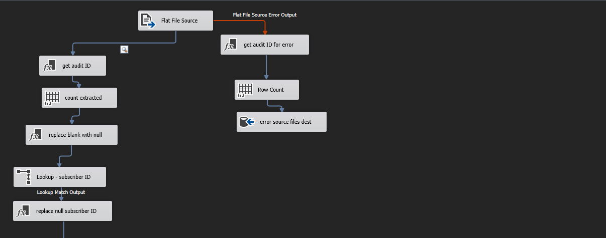
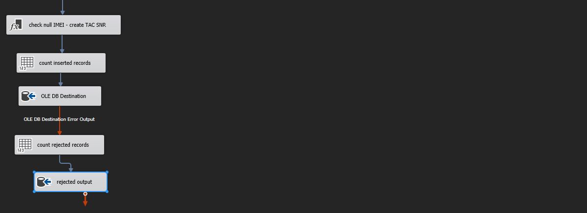

# Telecom-ETL-SSIS

### Overview
This project entails the development of an ETL (Extract, Transform, Load) solution for a telecom company's system that generates files in batches as CSV files in a base directory. The objective is to automate the process of extracting data from these files, performing necessary transformations, and loading it into the final destination database.

The data in these files are inconsistent, with missing values and cleanliness issues, imposing certain criteria and constraints for each column. The solution handles these challenges by:

* Validating data based on predefined criteria.
* Handling missing values by replacing them with null for numbers, strings, and dates.
* Performing various transformations such as:
  * Enforcing fixed lengths for certain columns.
  * Splitting column values to derive two new columns.
  * Utilizing lookup reference tables.
Furthermore, the solution audits the batch process by identifying each file in the batch and recording the number of rows extracted, loaded, and rejected. Upon completion of the ETL process, the solution archives processed files into another directory for record-keeping and maintenance.

### Prerequisites
SQL Server Integration Services (SSIS)
Access to the base directory containing batch files
Access to the final destination database

### Screenshot

