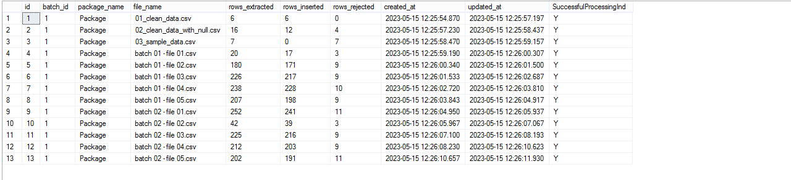

# Telecom-ETL-SSIS

### Overview
- It's a case study  of system  in telecom company  that generate files in batches as csv in a base directory and we need to develop a solution to automate and loop batch files to extract  , transform and load in final destination database

- Data in files are not inconsistent and are missing values and not clean so we have certain criteria and constraints for each column and when to accept and reject

- It also performs transformation on data
	* Some columns must have fixed number
	* Split column value to derive 2 new column
	* Lookup reference tables
	* Replace missing values with null for numbers , strings and dates

- It audits this batch process by identifying each file in the batch and recording number of rows extracted , loaded and rejected

- After completing this process it archive processed files into another archive directory

### Screenshot

